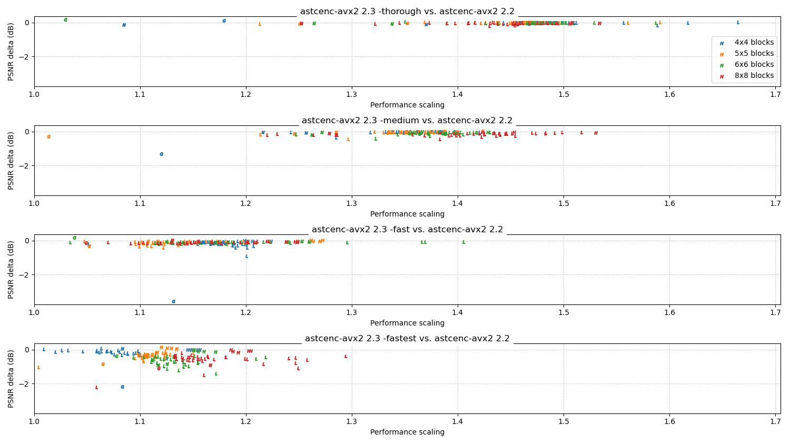
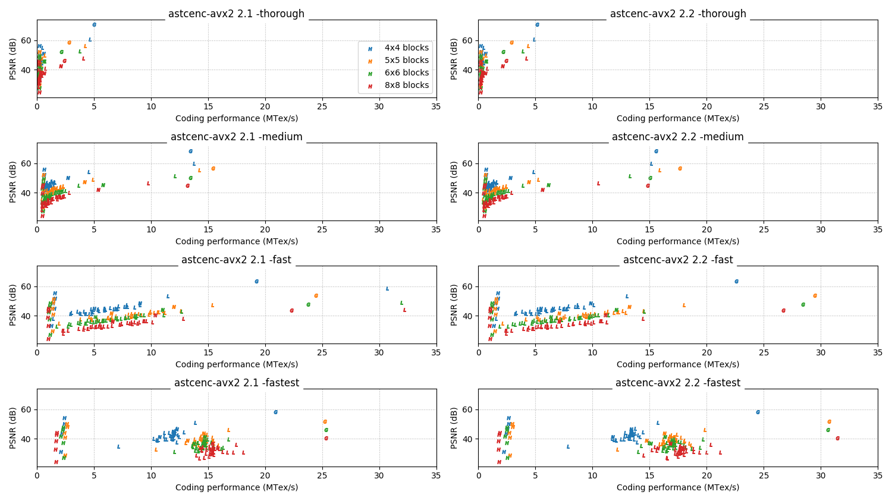
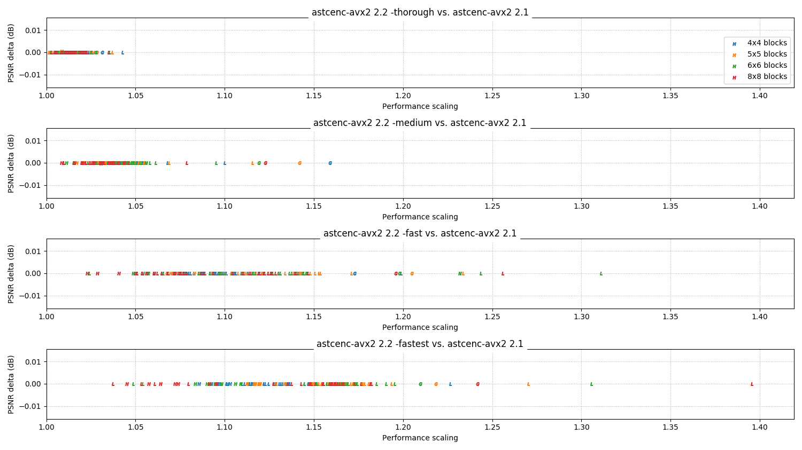
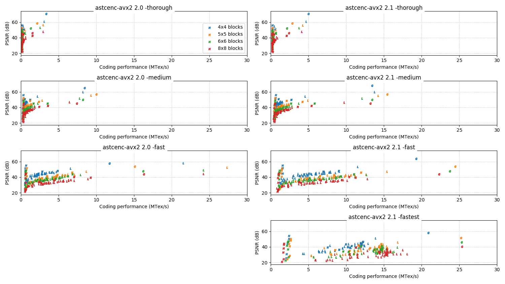
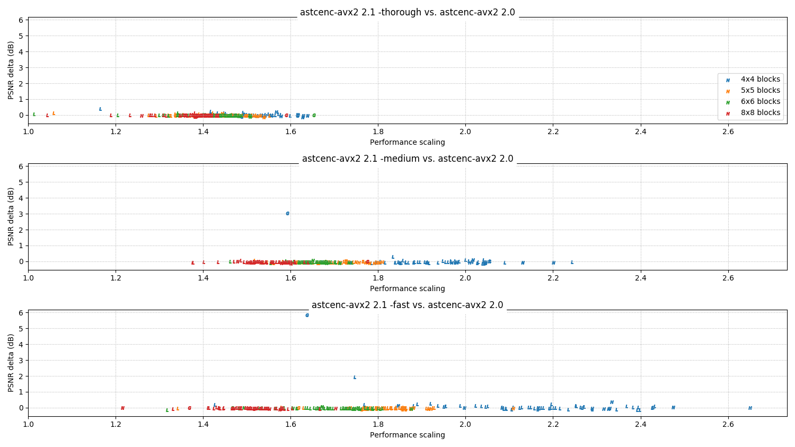
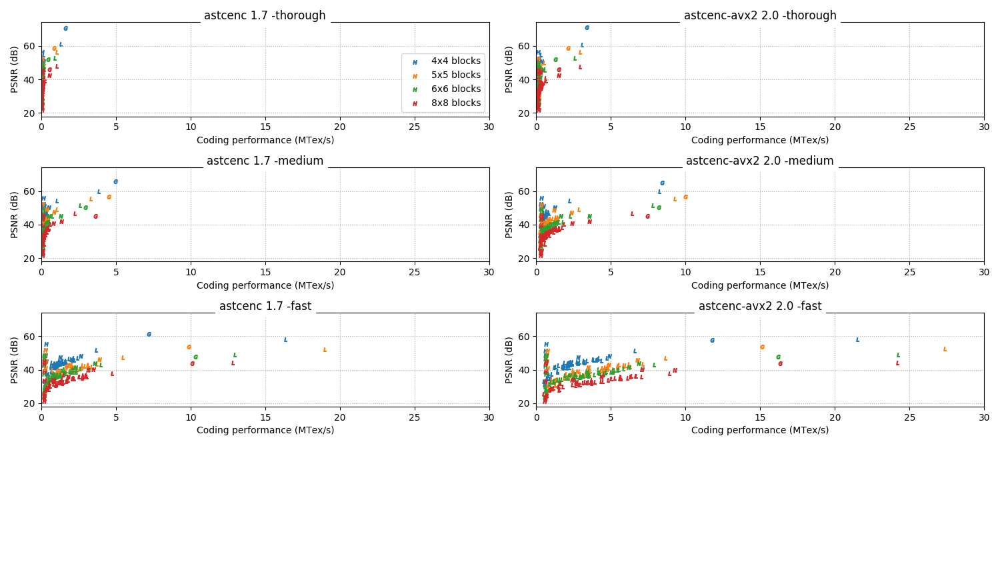
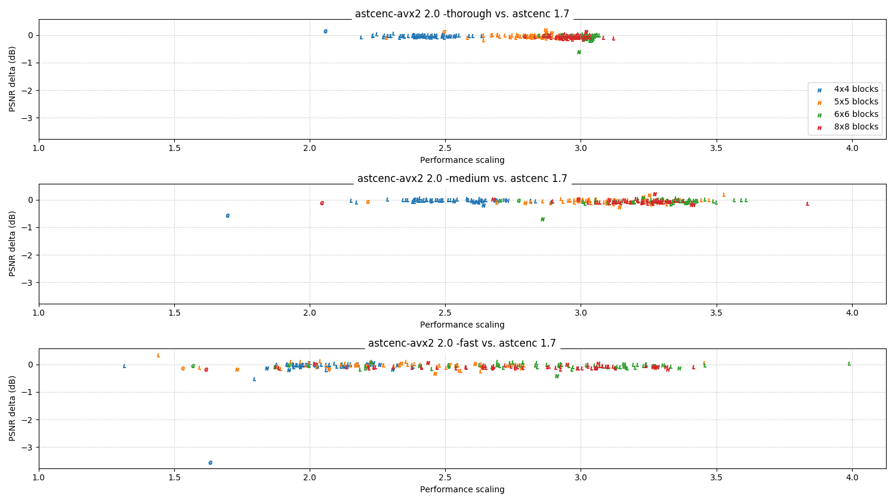

# 2.x series change log

This page summarizes the major functional and performance changes in each
release of the 2.x series.

All performance data on this page is measured on an Intel Core i5-9600K
clocked at 4.2 GHz, running astcenc using 6 threads.

<!-- ---------------------------------------------------------------------- -->
## 2.5

**Status:** Released, March 2021

The 2.5 release is the last major release in the 2.x series. After this release
a `2.x` branch will provide stable long-term support, and the `main` branch
will switch to focusing on more radical changes for the 3.x series.

Reminder for users of the library interface - the API is not designed to be
stable across versions, and this release is not compatible with earlier 2.x
releases. Please update and rebuild your client-side code using the updated
`astcenc.h` header.

**General:**
  * **Feature:** The `ISA_INVARIANCE` build option is no longer supported, as
    there is no longer any performance benefit from the variant paths. All
    builds are now using the equivalent of the `ISA_INVARIANCE=ON` setting, and
    all builds (except Armv7) are now believed to be invariant across operating
    systems, compilers, CPU architectures, and SIMD instruction sets.
  * **Feature:** Armv8 32-bit builds with NEON are now supported, with
    out-of-the-box support for Arm Linux soft-float and hard-float ABIs. There
    are no pre-built binaries for these targets; support is included for
    library users targeting older 32-bit Android and iOS devices.
  * **Feature:** A compressor mode for encoding HDR textures that have been
    encoded into LDR RGBM wrapper format is now supported. Note that this
    encoding has some strong recommendations for how the RGBM encoding is
    implemented to avoid block artifacts in the compressed image.
* **Core API:**
  * **API Change:** The core API has been changed to be a pure C API, making it
    easier to wrap the codec in a stable shared library ABI. Some entry points
    that used to accept references now expect pointers.
  * **API Change:** The decompression functionality in the core API has been
    changed to allow use of multiple threads. The design pattern matches the
    compression functionality, requiring the caller to create the threads,
    synchronize them between images, and to call the new
    `astcenc_decompress_reset()` function between images.
* **API Feature:** Defines to support exporting public API entry point
    symbols from a shared object are provided, but not exposed off-the-shelf by
    the CMake provided by the project.
  * **API Feature:** New `astcenc_get_block_info()` function added to the core
    API to allow users to perform high level analysis of compressed data. This
    API is not implemented in decompressor-only builds.
  * **API Feature:** Codec configuration structure has been extended to expose
    the new RGBM compression mode. See the API header for details.

<!-- ---------------------------------------------------------------------- -->
## 2.4

**Status:** Released, February 2021

The 2.4 release is the fifth release in the 2.x series. It is primarily a bug
fix release for HDR image handling, which impacts all earlier 2.x series
releases.

**General:**
  * **Feature:** When using the `-a` option, or the equivalent config option
    for the API, any 2D blocks that are entirely zero alpha after the alpha
    filter radius is taken into account are replaced by transparent black
    constant color blocks. This is an RDO-like technique to improve compression
    ratios of any additional application packaging compression that is applied.
**Command Line:**
  * **Bug fix:** The command line wrapper now correctly loads HDR images that
    have a non-square aspect ratio.

<!-- ---------------------------------------------------------------------- -->
## 2.3

**Status:** Released, January 2021

The 2.3 release is the fourth release in the 2.x series. It includes a number
of performance improvements and new features.

Reminder for users of the library interface - the API is not designed to be
stable across versions, and this release is not compatible with 2.2. Please
recompile your client-side code using the updated `astcenc.h` header.

* **General:**
  * **Feature:** Decompressor-only builds of the codec are supported again.
    While this is primarily a feature for library users who want to shrink
    binary size, a variant command line tool `astcdec` can be built by
    specifying `DECOMPRESSOR=ON` on the CMake configure command line.
  * **Feature:** Diagnostic builds of the codec can now be built. These builds
    generate a JSON file containing a trace of the compressor execution.
    Diagnostic builds are only suitable for codec development; they are slower
    and JSON generation cannot be disabled. Build by setting `DIAGNOSTICS=ON`
    on the CMake configure command line.
  * **Feature:** Code compatibility improved with older versions of GCC,
    earliest compiler now tested is GCC 7.5 (was GCC 9.3).
  * **Feature:** Code compatibility improved with newer versions of LLVM,
    latest compiler now tested is Clang 12.0 (was Clang 9.0).
  * **Feature:** Code compatibility improved with the Visual Studio 2019 LLVM
    toolset (`clang-cl`). Using the LLVM toolset gives 25% performance
    improvements and is recommended.
* **Command Line:**
  * **Feature:** Quality level now accepts either a preset (`-fast`, etc) or a
    float value between 0 and 100, allowing more control over the compression
    quality vs performance trade-off. The presets are not evenly spaced in the
    float range; they have been spaced to give the best distribution of points
    between the fast and thorough presets.
    * `-fastest`: 0.0
    * `-fast`: 10.0
    * `-medium`: 60.0
    * `-thorough`: 98.0
    * `-exhaustive`: 100.0
* **Core API:**
  * **API Change:** Quality level preset enum replaced with a float value
    between 0 (`-fastest`) and 100 (`-exhaustive`). See above for more info.

### Performance

This release includes a number of optimizations to improve performance.

* New compressor algorithm for handling encoding candidates and refinement.
* Vectorized implementation of `compute_error_of_weight_set()`.
* Unrolled implementation of `encode_ise()`.
* Many other small improvements!

The most significant change is the change to the compressor path, which now
uses an adaptive approach to candidate trials and block refinement.

In earlier releases the quality level will determine the number of encoding
candidates and the number of iterative refinement passes that are used for each
major encoding trial. This is a fixed behavior; it will always try the full N
candidates and M refinement iterations specified by the quality level for each
encoding trial.

The new approach implements two optimizations for this:

* Compression will complete when a block candidate hits the specified target
  quality, after its M refinement iterations have been applied. Later block
  candidates are simply abandoned.
* Block candidates will predict how much refinement can improve them, and
  abandon refinement if they are unlikely to improve upon the best known
  encoding already in-hand.

This pair of optimizations provides significant performance improvement to the
high quality modes which use the most block candidates and refinement
iterations. A minor loss of image quality is expected, as the blocks we no
longer test or refine may have been better coding choices.

**Absolute performance vs 2.2 release:**

**Relative performance vs 2.2 release:**

<!-- ---------------------------------------------------------------------- -->
## 2.2

**Status:** Released, January 2021

The 2.2 release is the third release in the 2.x series. It includes a number
of performance improvements and new features.

Reminder for users of the library interface - the API is not designed to be
stable across versions, and this release is not compatible with 2.1. Please
recompile your client-side code using the updated `astcenc.h` header.

* **General:**
  * **Feature:** New Arm aarch64 NEON accelerated vector library support.
  * **Improvement:** New CMake build system for all platforms.
  * **Improvement:** SSE4.2 feature profile changed to SSE4.1, which more
    accurately reflects the feature set used.
* **Binary releases:**
  * **Improvement:** Linux binaries changed to use Clang 9.0, which gives
    up to 15% performance improvement.
  * **Improvement:** Windows binaries are now code signed.
  * **Improvement:** macOS binaries for Apple silicon platforms now provided.
  * **Improvement:** macOS binaries are now code signed and notarized.
* **Command Line:**
  * **Feature:** New image preprocess `-pp-normalize` option added. This forces
    normal vectors to be unit length, which is useful when compressing source
    textures that use normal length to encode an NDF, which is incompatible
    with ASTC's two channel encoding.
  * **Feature:** New image preprocess `-pp-premultiply` option added. This
    scales RGB values by the alpha value. This can be useful to minimize
    cross-channel color bleed caused by GPU post-multiply filtering/blending.
  * **Improvements:** Command line tool cleanly traps and reports errors for
    corrupt input images rather than relying on standard library `assert()`
    calls in release builds.
* **Core API:**
  * **API Change:** Images using region-based metrics no longer need to include
    padding; all input images should be tightly packed and `dim_pad` is removed
    from the `astcenc_image` structure. This makes it easier to directly use
    images loaded from other libraries.
  * **API Change:** Image `data` is no longer a 3D array accessed using
    `data[z][y][x]` indexing, it's an array of 2D slices. This makes it easier
    to directly use images loaded from other libraries.
  * **API Change:** New `ASTCENC_FLG_SELF_DECOMPRESS_ONLY` flag added to the
    codec config. Using this flag enables additional optimizations that
    aggressively exploit implementation- and configuration-specific, behavior
    to gain performance. When using this flag the codec can only reliably
    decompress images that were compressed in the same context session. Images
    produced via other means may fail to decompress correctly, even if they are
    otherwise valid ASTC files.

### Performance

There is one major set of optimizations in this release, related to the new
`ASTCENC_FLG_SELF_DECOMPRESS_ONLY` mode. These allow the compressor to only
create data tables it knows that it is going to use, based on its current set
of heuristics, rather than needing the full set the format allows.

The first benefit of these changes is a reduced context creation time, which
can be reduced by up to 250ms on our test machine. This is a significant
percentage of the command line utility runtime for a small image when using a
quick search preset. Compressing the whole Kodak test suite using the command
line utility and the `-fastest` preset is ~30% faster with this release, which
is mostly due to faster startup.

The reduction in the data table size in this mode also improve the core codec
speed. Our test sets show an average of 12% improvement in the codec for
`-fastest` mode, and an average of 3% for `-medium` mode.

Key for performance charts:

* Color = block size (see legend).
* Letter = image format (N = normal map, G = grayscale, L = LDR, H = HDR).

**Absolute performance vs 2.1 release:**

**Relative performance vs 2.1 release:**

<!-- ---------------------------------------------------------------------- -->
## 2.1

**Status:** Released, November 2020

The 2.1 release is the second release in the 2.x series. It includes a number
of performance optimizations and new features.

Reminder for users of the library interface - the API is not designed to be
stable across versions, and this release is not compatible with 2.0. Please
recompile your client-side code using the updated `astcenc.h` header.

### Features:

* **Command line:**
  * **Bug fix:** The meaning of the `-tH\cH\dH` and `-th\ch\dh` compression
    modes was inverted. They now match the documentation; use `-*H` for HDR
    RGBA, and `-*h` for HDR RGB with LDR alpha.
  * **Feature:** A new `-fastest` quality preset is now available. This is
    designed for fast "roughing out" of new content, and sacrifices significant
    image quality compared to `-fast`. We do not recommend its use for
    production builds.
  * **Feature:** A new `-candidatelimit` compression tuning option is now
    available. This is a power-user control to determine how many candidates
    are returned for each block mode encoding trial. This feature is used
	automatically by the search presets; see `-help` for details.
  * **Improvement:** The compression test modes (`-tl\ts\th\tH`) now emit a
    MTex/s performance metric, in addition to coding time.
* **Core API:**
  * **Feature:** A new quality preset `ASTCENC_PRE_FASTEST` is available. See
    `-fastest` above for details.
  * **Feature:** A new tuning option `tune_candidate_limit` is available in
    the config structure. See `-candidatelimit` above for details.
  * **Feature:** Image input/output can now use `ASTCENC_TYPE_F32` data types.
* **Stability:**
  * **Feature:** The SSE2, SSE4.2, and AVX2 variants now produce identical
    compressed output when run on the same CPU when compiled with the
    preprocessor define `ASTCENC_ISA_INVARIANCE=1`. For Make builds this can
    be set on the command line by setting `ISA_INV=1`. ISA invariance is off
    by default; it reduces performance by 1-3%.

### Performance

Key for performance charts:

* Color = block size (see legend).
* Letter = image format (N = normal map, G = grayscale, L = LDR, H = HDR).

**Absolute performance vs 2.0 release:**

**Relative performance vs 2.0 release:**

<!-- ---------------------------------------------------------------------- -->
## 2.0

**Status:** Released, August 2020

The 2.0 release is first release in the 2.x series. It includes a number of
major changes over the earlier 1.7 series, and is not command-line compatible.

### Features:

* The core codec can be built as a library, exposed via a new codec API.
* The core codec supports accelerated SIMD paths for SSE2, SSE4.2, and AVX2.
* The command line syntax has a clearer mapping to Khronos feature profiles.

### Performance:

Key for performance charts

* Color = block size (see legend).
* Letter = image format (N = normal map, G = grayscale, L = LDR, H = HDR).

**Absolute performance vs 1.7 release:**

**Relative performance vs 1.7 release:**

- - -

_Copyright © 2020-2022, Arm Limited and contributors. All rights reserved._
