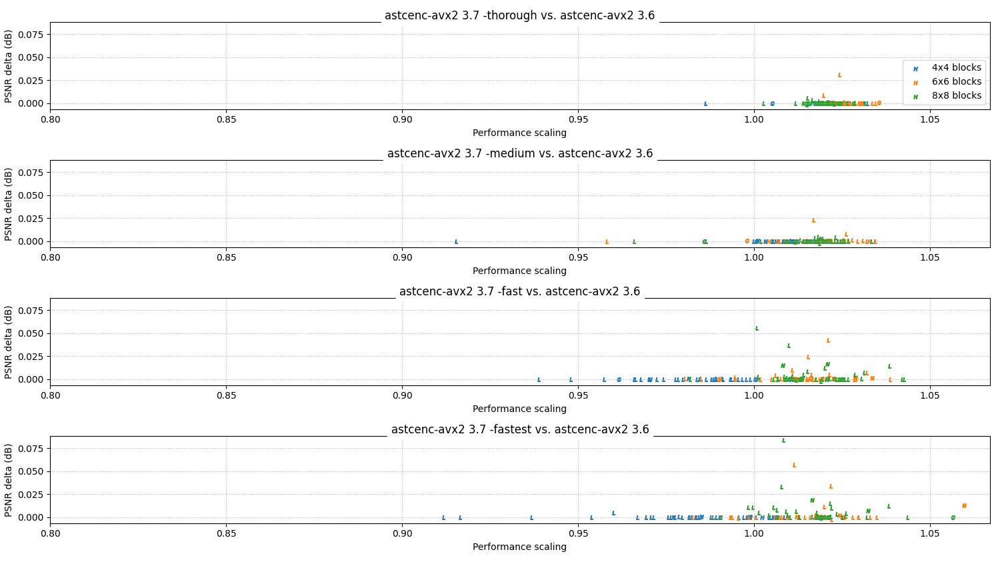
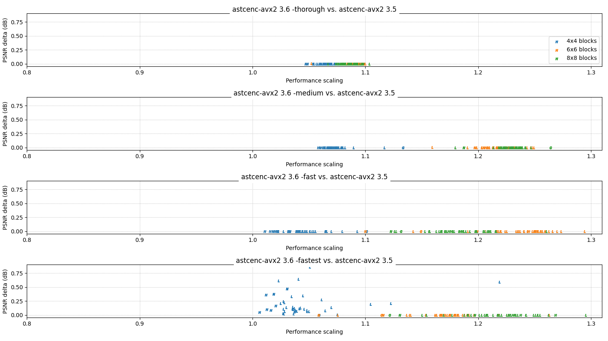
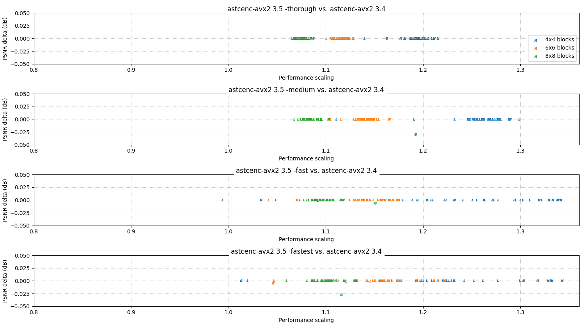
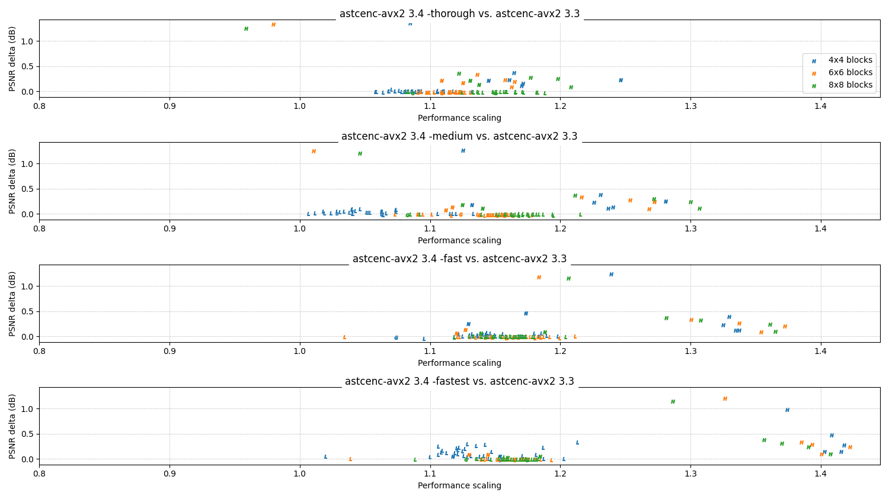
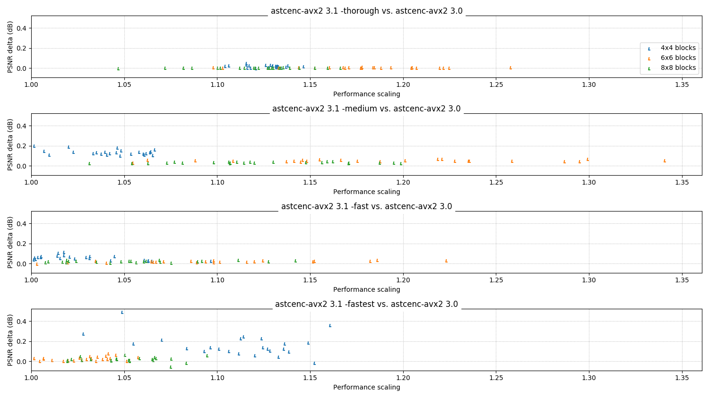
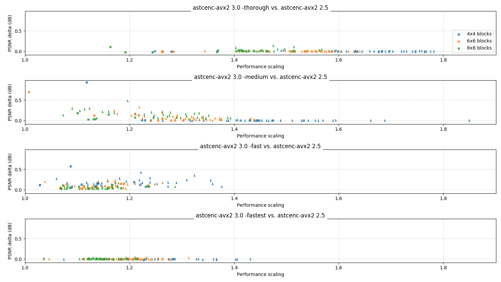

# 3.x series change log

This page summarizes the major functional and performance changes in each
release of the 3.x series.

All performance data on this page is measured on an Intel Core i5-9600K
clocked at 4.2 GHz, running `astcenc` using AVX2 and 6 threads.

<!-- ---------------------------------------------------------------------- -->
## 3.7

**Status:** April 2022

The 3.7 release contains another round of performance optimizations, including
significant improvements to the command line front-end (faster PNG loader) and
the arm64 build of the codec (faster NEON implementation).

* **General:**
  * **Feature:** The command line tool PNG loader has been switched to use
    the Wuffs library, which is robust and significantly faster than the
    current stb_image implementation.
  * **Feature:** Support for non-invariant builds returns. Opt-in to slightly
    faster, but not bit-exact, builds by setting `-DNO_INVARIANCE=ON` for the
    CMake configuration. This improves performance by around 2%.
  * **Optimization:** Changed SIMD `select()` so that it matches the default
    NEON behavior (bitwise select), rather than the default x86-64 behavior
    (lane select on MSB). Specialization `select_msb()` added for the one case
    we want to select on a sign-bit, where NEON needs a different
    implementation. This provides a significant (>25%) performance uplift on
    NEON implementations.

### Performance:

Key for charts:

* Color = block size (see legend).
* Letter = image format (N = normal map, G = grayscale, L = LDR, H = HDR).

**Relative performance vs 3.5 release:**

<!-- ---------------------------------------------------------------------- -->
## 3.6

**Status:** April 2022

The 3.6 release contains another round of performance optimizations.

There are no interface changes in this release, but in general the API is not
designed to be binary compatible across versions. We always recommend
rebuilding your client-side code using the updated `astcenc.h` header.

* **General:**
  * **Feature:** Data tables are now optimized for contexts without the
    `SELF_DECOMPRESS_ONLY` flag set. The flag therefore no longer improves
    compression performance, but still reduces context creation time and
    context data table memory footprint.
  * **Feature:** Image quality for 4x4 `-fastest` configuration has been
    improved.
  * **Optimization:** Decimation modes are reliably excluded from processing
    when they are only partially selected in the compressor configuration (e.g.
    if used for single plane, but not dual plane modes). This is a significant
    performance optimization for all quality levels.
  * **Optimization:** Fast-path block load function variant added for 2D LDR
    images with no swizzle. This is a moderate performance optimization for the
    fast and fastest quality levels.

### Performance:

Key for charts:

* Color = block size (see legend).
* Letter = image format (N = normal map, G = grayscale, L = LDR, H = HDR).

**Relative performance vs 3.5 release:**

<!-- ---------------------------------------------------------------------- -->
## 3.5

**Status:** March 2022

The 3.5 release contains another round of performance optimizations.

There are no interface changes in this release, but in general the API is not
designed to be binary compatible across versions. We always recommend
rebuilding your client-side code using the updated `astcenc.h` header.

* **General:**
  * **Feature:** Compressor configurations using `SELF_DECOMPRESS_ONLY` mode
    store compacted partition tables, which significantly improves both
    context create time and runtime performance.
  * **Feature:** Bilinear infill for decimated weight grids supports a new
    variant for half-decimated grids which are only decimated in one axis.

### Performance:

Key for charts:

* Color = block size (see legend).
* Letter = image format (N = normal map, G = grayscale, L = LDR, H = HDR).

**Relative performance vs 3.4 release:**

<!-- ---------------------------------------------------------------------- -->
## 3.4

**Status:** February 2022

The 3.4 release introduces another round of optimizations, removing a number
of power-user configuration options to simplify the core compressor data path.

Reminder for users of the library interface - the API is not designed to be
binary compatible across versions, and this release is not compatible with
earlier releases. Please update and rebuild your client-side code using the
updated `astcenc.h` header.

* **General:**
  * **Feature:** Many memory allocations have been moved off the stack into
    dynamically allocated working memory. This significantly reduces the peak
    stack usage, allowing the compressor to run in systems with 128KB stack
    limits.
  * **Feature:** Builds now support `-DBLOCK_MAX_TEXELS=<count>` to allow a
    compressor to support a subset of block sizes. This can reduce binary size
    and runtime memory footprint, and improve performance.
  * **Feature:** The `-v` and `-va` options to set a per-texel error weight
    function are no longer supported.
  * **Feature:** The `-b` option to set a per-texel error weight boost for
    block border texels is no longer supported.
  * **Feature:** The `-a` option to set a per-texel error weight based on texel
    alpha value is no longer supported as an error weighting tool, but is still
    supported for providing sprite-sheet RDO.
  * **Feature:** The `-mask` option to set an error metric for mask map
    textures is still supported, but is currently a no-op in the compressor.
  * **Feature:** The `-perceptual` option to set a perceptual error metric is
    still supported, but is currently a no-op in the compressor for mask map
    and normal map textures.
  * **Bug-fix:** Corrected decompression of error blocks in some cases, so now
    returning the expected error color (magenta for LDR, NaN for HDR). Note
    that astcenc determines the error color to use based on the output image
    data type not the decoder profile.
* **Binary releases:**
  * **Improvement:** Windows binaries changed to use ClangCL 12.0, which gives
    up to 10% performance improvement.

### Performance:

Key for charts:

* Color = block size (see legend).
* Letter = image format (N = normal map, G = grayscale, L = LDR, H = HDR).

**Relative performance vs 3.3 release:**

<!-- ---------------------------------------------------------------------- -->
## 3.3

**Status:** November 2021

The 3.3 release improves image quality for normal maps, and two component
textures. Normal maps are expected to compress 25% slower than the 3.2
release, although it should be noted that they are still faster to compress
in 3.3 than when using the 2.5 series. This release also fixes one reported
stability issue.

* **General:**
  * **Feature:** Normal map image quality has been improved.
  * **Feature:** Two component image quality has been improved, provided
    that unused components are correctly zero-weighted using e.g. `-cw` on the
    command line.
  * **Bug-fix:** Improved stability when trying to compress complex blocks that
    could not beat even the starting quality threshold. These will now always
    compress in to a constant color blocks.

<!-- ---------------------------------------------------------------------- -->
## 3.2

**Status:** August 2021

The 3.2 release is a bugfix release; no significant image quality or
performance differences are expected.

* **General:**
  * **Bug-fix:** Improved stability when new contexts were created while other
    contexts were compressing or decompressing an image.
  * **Bug-fix:** Improved stability when decompressing blocks with invalid
    block encodings.

<!-- ---------------------------------------------------------------------- -->
## 3.1

**Status:** July 2021

The 3.1 release gives another performance boost, typically between 5 and 20%
faster than the 3.0 release, as well as further incremental improvements to
image quality. A number of build system improvements make astcenc easier and
faster to integrate into other projects as a library, including support for
building universal binaries on macOS. Full change list is shown below.

Reminder for users of the library interface - the API is not designed to be
binary compatible across versions, and this release is not compatible with
earlier releases. Please update and rebuild your client-side code using the
updated `astcenc.h` header.

* **General:**
  * **Feature:** RGB color data now supports `-perceptual` operation. The
    current implementation is simple, weighting color channel errors by their
    contribution to perceived luminance. This mimics the behavior of the human
    visual system, which is most sensitive to green, then red, then blue.
  * **Feature:** Codec supports a new low weight search mode, which is a
    simpler weight assignment for encodings with a low number of weights in the
    weight grid. The weight threshold can be overridden using the new
    `-lowweightmodelimit` command line option.
  * **Feature:** All platform builds now support building a native binary.
    Native binaries automatically select the SIMD level based on the default
    configuration of the compiler in use. Native binaries built on one machine
    may use different SIMD options than native binaries build on another.
  * **Feature:** macOS platform builds now support building universal binaries
    containing both `x86_64` and `arm64` target support.
  * **Feature:** Building the command line can be disabled when using as a
    library in another project. Set `-DCLI=OFF` during the CMake configure
    step.
  * **Feature:** A standalone minimal example of the core codec API usage has
    been added in the `./Utils/Example/` directory.
* **Core API:**
  * **Feature:** Config flag `ASTCENC_FLG_USE_PERCEPTUAL` works for color data.
  * **Feature:** Config option `tune_low_weight_count_limit` added.
  * **Feature:** New heuristic added which prunes dual weight plane searches if
    they are unlikely to help. This heuristic is not user controllable.
  * **Feature:** Image quality has been improved. In general we see significant
    improvements (up to 0.2dB) for high bitrate encodings (4x4, 5x4), and a
    smaller improvement (up to 0.1dB) for lower bitrate encodings.
  * **Bug fix:** Arm "none" SIMD builds could be invariant with other builds.
    This fix has also been back-ported to the 2.x LTS branch.

### Performance:

Key for charts:

* Color = block size (see legend).
* Letter = image format (N = normal map, G = grayscale, L = LDR, H = HDR).

**Relative performance vs 3.0 release:**

<!-- ---------------------------------------------------------------------- -->
## 3.0

**Status:** June 2021

The 3.0 release is the first in a series of updates to the compressor that are
making more radical changes than we felt we could make with the 2.x series.
The primary goals of the 3.x series are to keep the image quality ~static or
better compared to the 2.5 release, but continue to improve performance.

Reminder for users of the library interface - the API is not designed to be
binary compatible across versions, and this release is not compatible with
earlier releases. Please update and rebuild your client-side code using the
updated `astcenc.h` header.

* **General:**
  * **Feature:** The code has been significantly cleaned up, with improved
    comments, API documentation, function naming, and variable naming.
* **Core API:**
  * **API Change:** The core APIs for `astcenc_compress_image()` and for
    `astcenc_decompress_image()` now accept swizzle structures by `const`
    pointer, instead of pass-by-value.
  * **API Change:** Calling the `astcenc_compress_reset()` and the
    `astcenc_decompress_reset()` functions between images is no longer required
    if the context was created for use by a single thread.
  * **Feature:** New heuristics have been added for controlling when to search
    beyond 2 partitions and 1 plane, and when to search beyond 3 partitions and
    1 plane. The previous `tune_partition_early_out_limit` config option has
    been removed, and replaced with two new options
    `tune_2_partition_early_out_limit_factor` and
    `tune_3_partition_early_out_limit_factor`. See command line help for more
    detailed documentation.
  * **Feature:** New heuristics have been added for controlling when to use
    dual weight planes. The previous `tune_two_plane_early_out_limit` has been
    renamed to`tune_2_plane_early_out_limit_correlation`. See command line help
    for more detailed documentation.
  * **Feature:** Support for using dual weight planes has been restricted to
    single partition blocks; it rarely helps blocks with 2 or more partitions
    and takes considerable compression search time.

### Performance:

Key for charts:

* Color = block size (see legend).
* Letter = image format (N = normal map, G = grayscale, L = LDR, H = HDR).

**Relative performance vs 2.5 release:**

- - -

_Copyright © 2021-2022, Arm Limited and contributors. All rights reserved._
