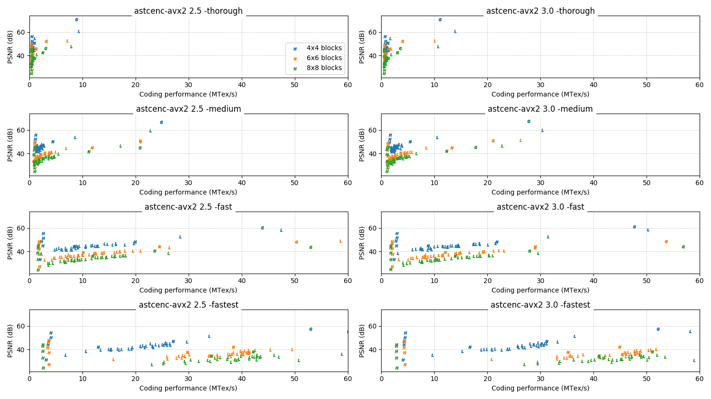

# 3.x series change log

This page summarizes the major functional and performance changes in each
release of the 3.x series.

All performance data on this page is measured on an Intel Core i5-9600K
clocked at 4.2 GHz, running astcenc using AVX2 and 6 threads.

<!-- ---------------------------------------------------------------------- -->
## 3.0

**Status:** June 2021

The 3.0 release is the first in a series of updates to the compressor that are
making more radical changes than we felt we could make with the 2.x series.
The primary goals of the 3.x series are to keep the image quality ~static or
better compared to the 2.5 release, but continue to improve performance.

Reminder for users of the library interface - the API is not designed to be
binary compatible across versions, and this release is not compatible with
earlier releases. Please update and rebuild your client-side code using the
updated `astcenc.h` header.

* **General:**
  * **Feature:** The code has been significantly cleaned up, with improved
    comments, API documentation, function naming, and variable naming.
* **Core API:**
  * **API Change:** The core APIs for `astcenc_compress_image()` and for
    `astcenc_decompress_image()` now accept swizzle structures by `const`
    pointer, instead of pass-by-value.
  * **API Change:** Calling the `astcenc_compress_reset()` and the
    `astcenc_decompress_reset()` functions between images is no longer required
    if the context was created for use by a single thread.
  * **Feature:** New heuristics have been added for controlling when to search
    beyond 2 partitions and 1 plane, and when to search beyond 3 partitions and
    1 plane. The previous `tune_partition_early_out_limit` config option has
    been removed, and replaced with two new options
    `tune_2_partition_early_out_limit_factor` and
    `tune_3_partition_early_out_limit_factor`. See command line help for more
    detailed documentation.
  * **Feature:** New heuristics have been added for controlling when to use
    dual weight planes. The previous `tune_two_plane_early_out_limit` has been
    renamed to`tune_2_plane_early_out_limit_correlation`. See command line help
    for more detailed documentation.
  * **Feature:** Support for using dual weight planes has been restricted to
    single partition blocks; it rarely helps blocks with 2 or more partitions
    and takes considerable compression search time.

### Performance:

Key for charts:

* Color = block size (see legend).
* Letter = image format (N = normal map, G = greyscale, L = LDR, H = HDR).

**Absolute performance vs 2.5 release:**

**Relative performance vs 2.5 release:**

