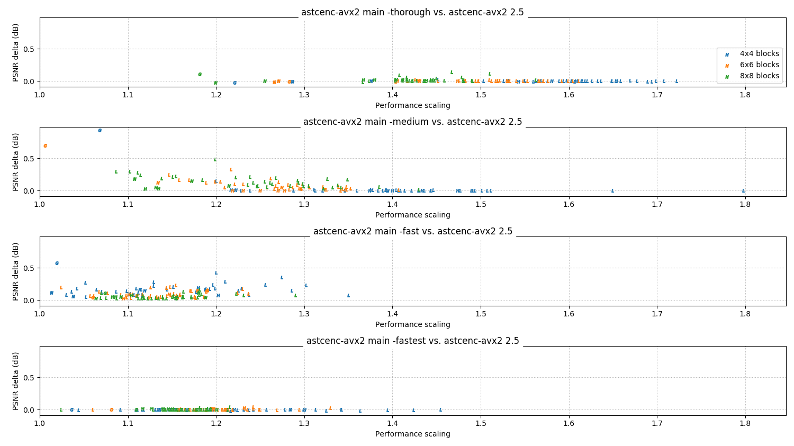

# 3.x series change log

This page summarizes the major functional and performance changes in each
release of the 3.x series.

All performance data on this page is measured on an Intel Core i5-9600K
clocked at 4.2 GHz, running astcenc using AVX2 and 6 threads.

<!-- ---------------------------------------------------------------------- -->
## 3.0

**Status:** ETA, August 2021

The 3.0 alpha release is a preview release for the 3.x series. This series is
aiming to provide a major update to the codec with more experimental changes
than we could make with the 2.x series.

Reminder for users of the library interface - the API is not designed to be
binary compatible across versions, and this release is not compatible with
earlier releases. Please update and rebuild your client-side code using the
updated `astcenc.h` header.

* **General:**
  * **Feature:** The code has been significantly cleaned up, with improved
    API documentation, function and variable naming conventions, and comments.
* **Core API:**
  * **Feature:** New heuristics have been added for controlling when to search
    beyond 2 partitions and 1 plane, and when to search beyond 3 partitions and
    1 plane. The previous `tune_partition_early_out_limit` config option has
    been removed, and replaced with two new options
    `tune_2_partition_early_out_limit_factor` and
    `tune_3_partition_early_out_limit_factor`. See command line help for more
    detailed documentation.
  * **Feature:** New heuristics have been added for controlling when to use
    2 planes. The previous `tune_two_plane_early_out_limit` has been renamed to
    `tune_2_plane_early_out_limit_correlation` and a new heuristic
    `tune_2_plane_early_out_limit_factor` has been added. See command line help
    for more detailed documentation.
  * **API Change:** The core APIs for `astcenc_compress_image()` and for
    `astcenc_decompress_image()` now accept swizzle structures by `const`
    pointer, instead of pass-by-value.
  * **API Change:** Calling the `astcenc_compress_reset()` and the
    `astcenc_decompress_reset()` functions between images is no longer required
    if the context was created for use by a single thread.

### Performance:

The current performance and image quality for the 3.0 development build vs the
stable 2.5 release is shown below.

* Color = block size (see legend).
* Letter = image format (N = normal map, G = greyscale, L = LDR, H = HDR).

**Relative performance vs 2.5 release:**

