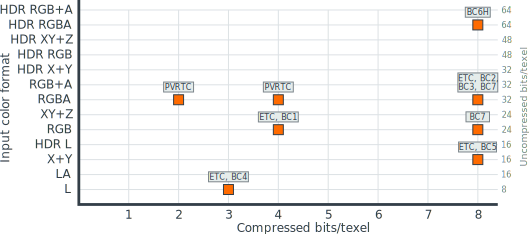
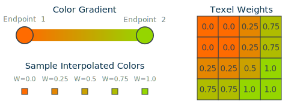
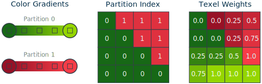
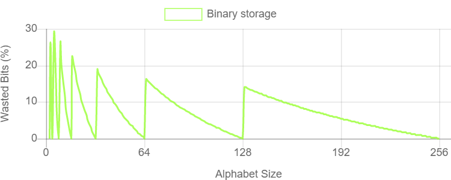
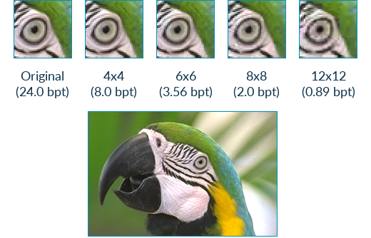
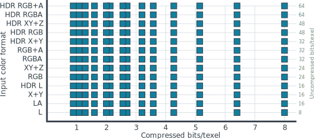

# ASTC Format Overview

Adaptive Scalable Texture Compression (ASTC) is an advanced lossy texture
compression technology developed by Arm and AMD. It has been adopted as an
official Khronos extension to the OpenGL and OpenGL ES APIs, and as a standard
optional feature for the Vulkan API.

ASTC offers a number of advantages over earlier texture compression formats:

* **Format flexibility:** ASTC supports compressing between 1 and 4 channels of
  data, including support for one non-correlated channel such as RGB+A
  (correlated RGB, non-correlated alpha).
* **Bit rate flexibility:** ASTC supports compressing images with a fine
  grained choice of bit rates between 0.89 and 8 bits per texel (bpt). The bit
  rate choice is independent to the color format choice.
* **Advanced format support:** ASTC supports compressing images in either low
  dynamic range (LDR), LDR sRGB, or high dynamic range (HDR) color spaces, as
  well as support for compressing 3D volumetric textures.
* **Improved image quality:** Despite the high degree of format flexibility,
  ASTC manages to beat nearly all legacy texture compression formats -- such as
  ETC2, PVRCT, and the BC formats -- on image quality at equivalent bit
  rates.

This article explores the ASTC format, and how it manages to generate the
flexibility and quality improvements that it achieves.

Why ASTC?
=========

Before the creation of ASTC, the format and bit rate coverage of the available
formats was very sparse:

In reality the situation is even worse than this diagram shows, as many of
these formats are proprietary or simply not available on some operating
systems, so any single platform will have very limited compression choices.

For developers this situation makes developing content which is portable across
multiple platforms a tricky proposition. It's almost certain that differently
compressed assets will be needed for different platforms. Each asset pack would
likely then need to use different levels of compression, and may even have to
fall back to no compression for some assets on some platforms, which leaves
either some image quality or some memory bandwidth efficiency untapped.

It was clear a better way was needed, so the Khronos group asked members to
submit proposals for a new compression algorithm to be adopted in the same
manner that the earlier ETC algorithm was adopted for OpenGL ES. ASTC was the
result of this, and has been adopted as an official algorithm for OpenGL,
OpenGL ES, and Vulkan.

Format overview
===============

Given the fragmentation issues with the existing compression formats, it should
be no surprise that the high level design objectives for ASTC were to have
something which could be used across the whole range of art assets found in
modern content, and which allows artists to have more control over the quality
to bit rate tradeoff.

There are quite a few technical components which make up the ASTC format, so
before we dive into detail it will be useful to give an overview of how ASTC
works at a higher level.

Block compression
-----------------

Compression formats for real-time graphics need the ability to quickly and
efficiently make random samples into a texture. This places two technical
requirements on any compression format:

* It must be possible to compute the address of data in memory given only a
  sample coordinate.
* It must be possible to decompress random samples without decompressing too
  much surrounding data.

The standard solution for this used by all contemporary real-time formats,
including ASTC, is to divide the image into fixed-size blocks of texels, each
of which is compressed into a fixed number of output bits. This feature makes
it possible to access texels quickly, in any order, and with a well-bounded
decompression cost.

The 2D block footprints in ASTC range from 4x4 texels up to 12x12 texels, which
all compress into 128-bit output blocks. By dividing 128 bits by the number of
texels in the footprint, we derive the format bit rates which range from 8 bpt
(`128/(4*4)`) down to 0.89 bpt (`128/(12*12)`).

Color encoding
--------------

ASTC uses gradients to assign the color values of each texel. Each compressed
block stores the end-point colors for a gradient, and an interpolation weight
for each texel which defines the texel's location along that gradient. During
decompression the color value for each texel is generated by interpolating
between the two end-point colors, based on the per-texel weight.

In many cases a block will contain a complex distribution of colors, for
example a red ball sitting on green grass. In these scenarios a single color
gradient will not be able to accurately represent all of the texels' values. To
support this ASTC allows a block to define up to four distinct color gradients,
known as partitions, and can assign each texel to a single partition. For our
example we require two partitions, one for our ball texels and one for our
grass texels.

Now that you know the high level operation of the format, we can dive into more
detail.

Integer encoding
================

Initially the idea of fractional bits per texel sounds implausible, or even
impossible, because we're so used to storing numbers as a whole number of bits.
However, it's not quite as strange as it sounds. ASTC uses an encoding
technique called Bounded Integer Sequence Encoding (BISE), which makes heavy
use of storing numbers with a fractional number of bits to pack information
more efficiently.

Storing alphabets
-----------------

Even though color and weight values per texel are notionally floating-point
values, we have far too few bits available to directly store the actual values,
so they must be quantized during compression to reduce the storage size. For
example, if we have a floating-point weight for each texel in the range 0.0 to
1.0 we could choose to quantize it to five values - 0.0, 0.25, 0.5, 0.75, and
1.0 - which we can then represent in storage using the integer values 0 to 4.

In the general case we need to be able to efficiently store characters of an
alphabet containing N symbols if we choose quantize to N levels. An N symbol
alphabet contains `log2(N)` bits of information per character. If we have an
alphabet of 5 possible symbols then each character contains ~2.32 bits of
information, but simple binary storage would require us to round up to 3 bits.
This wastes 22.3% of our storage capacity. The chart below shows the percentage
of our bit-space wasted when using simple binary encoding to store an arbitrary
N symbol alphabet:

... which shows for most alphabet sizes we waste a lot of our storage capacity
when using an integer number of bits per character. Efficiency is of critical
importance to a compression format, so this is something we needed to be able
to improve.

**Note:** We could have chosen to round-up the quantization level to the next
power of two, and at least use the bits we're spending. However, this forces
the encoder to spend bits which could be used elsewhere for a bigger benefit,
so it will reduce image quality and is a sub-optimal solution.

Quints
------

Instead of rounding up a 5 symbol alphabet - called a "quint" in BISE - to
three bits, we could choose to instead pack three quint characters together.
Three characters in a 5-symbol alphabet have 53 (125) combinations,
and contain 6.97 bits of information. We can store this in 7 bits and have a
storage waste of only 0.5%.

Trits
-----

We can similarly construct a 3-symbol alphabet - called a "trit" in BISE - and
pack trit characters in groups of five. Each character group has 35
(243) combinations, and contains 7.92 bits of information. We can store this in
8 bits and have a storage waste of only 1%.

BISE
----

The BISE encoding used by ASTC allows storage of character sequences using
arbitrary alphabets of up to 256 symbols, encoding each alphabet size in the
most space-efficient choice of bits, trits, and quints.

* Alphabets with up to (2n - 1) symbols can be encoded using n bits
  per character.
* Alphabets with up (3 * 2n - 1) symbols can be encoded using n bits
  (m) and a trit (t) per character, and reconstructed using the equation
  (t * 2n + m).
* Alphabets with up to (5 * 2n - 1) symbols can be encoded using n
  bits (m) and a quint (q) per character, and reconstructed using the equation
  (q * 2n + m).

When the number of characters in a sequence is not a multiple of three or five
we need to avoid wasting storage at the end of the sequence, so we add another
constraint on the encoding. If the last few values in the sequence to encode
are zero, the last few bits in the encoded bit string must also be zero.
Ideally, the number of non-zero bits should be easily calculated and not depend
on the magnitudes of the previous encoded values. This is a little tricky to
arrange during compression, but it is possible. This means that we do not need
to store any padding after the end of the bit sequence, as we can safely assume
that they are zero bits.

With this constraint in place - and by some smart packing the bits, trits, and
quints - BISE encodes an string of S characters in an N symbol alphabet using a
fixed number of bits:

* S values up to (2n - 1) uses (NS) bits.
* S values up to (3 * 2n - 1) uses (NS + ceil(8S / 5)) bits.
* S values up to (5 * 2n - 1) uses (NS + ceil(7S / 3)) bits.

... and the compressor will choose the one of these which produces the smallest
storage for the alphabet size being stored; some will use binary, some will use
bits and a trit, and some will use bits and a quint. If we compare the storage
efficiency of BISE against simple binary for the range of possible alphabet
sizes we might want to encode we can see that it is much more efficient.

Block sizes
===========

ASTC always compresses blocks of texels into 128-bit outputs, but allows the
developer to select from a range of block sizes to enable a fine-grained
tradeoff between image quality and size.

| Block footprint | Bits/texel |     | Block footprint | Bits/texel |
| --------------- | ---------- | --- | --------------- | ---------- |
|             4x4 |       8.00 |     |            10x5 |       2.56 |
|             5x4 |       6.40 |     |            10x6 |       2.13 |
|             5x5 |       5.12 |     |             8x8 |       2.00 |
|             6x5 |       4.27 |     |            10x8 |       1.60 |
|             6x6 |       3.56 |     |           10x10 |       1.28 |
|             8x5 |       3.20 |     |           12x10 |       1.07 |
|             8x6 |       2.67 |     |           12x12 |       0.89 |

Color endpoints
===============

The color data for a block is encoded as a gradient between two color
endpoints, with each texel selecting a position along that gradient which is
then interpolated during decompression. ASTC supports 16 color endpoint
encoding schemes, known as "endpoint modes". Options for endpoint modes
include:

* Varying the number of color channels: e.g. luminance, luminance + alpha, rgb,
  and rgba.
* Varying the encoding method: e.g. direct, base+offset, base+scale,
  quantization level.
* Varying the data range: e.g. low dynamic range, or high dynamic range

The endpoint modes, and the endpoint color BISE quantization level, can be
chosen on a per-block basis.

Color partitions
================

Colors within a block are often complex, and cannot be accurately captured by a
single color gradient, as discussed earlier with our example of a red ball
lying on green grass. ASTC allows up to four color gradients - known as
"partitions" - to be assigned to a single block. Each texel is then assigned to
a single partition for the purposes of decompression.

Rather then directly storing the partition assignment for each texel, which
would need a lot of decompressor hardware to store it for all block sizes, we
generate it procedurally. Each block only needs to store the partition index -
which is the seed for the procedural generator - and the per texel assignment
can then be generated on-the-fly during decompression. The image below shows
the generated texel assignments for two (top), three (middle), and four
(bottom) partitions for the 8x8 block size.

The number of partitions and the partition index can be chosen on a per-block
basis, and a different color endpoint mode can be chosen per partition.

**Note:** ASTC uses a 10-bit seed to drive the partition assignments. The hash
used will introduce horizontal bias in a third of the partitions, vertical bias
in a third, and no bias in the rest. As they are procedurally generated not all
of the partitions are useful, in particular with the smaller block sizes.

* Many partitions are duplicates.
* Many partitions are degenerate (an N partition hash results in at least one
  partition assignment that contains no texels).

Texel weights
=============

Each texel requires a weight, which defines the relative contribution of each
color endpoint when interpolating the color gradient.

For smaller block sizes we can choose to store the weight directly, with one
weight per texel, but for the larger block sizes we simply do not have enough
bits of storage to do this. To work around this ASTC allows the weight grid to
be stored at a lower resolution than the texel grid. The per-texel weights are
interpolated from the stored weight grid during decompression using a bilinear
interpolation.

The number of texel weights, and the weight value BISE quantization level, can
be chosen on a per-block basis.

Dual-plane weights
------------------

Using a single weight for all color channels works well when there is good
correlation across the channels, but this is not always the case. Common
examples where we would expect to get low correlation at least some of the time
are textures storing RGBA data - alpha masks are not usually closely
correlated with the color value - or normal data - the X and Y normal values
often change independently.

ASTC allows a dual-plane mode, which uses two separate weight grids for each
texel. A single channel can be assigned to a second plane of weights, while
the other three use the first plane of weights.

The use of dual-plane mode can be chosen on a per-block basis, but its use
prevents the use of four color partitions as we do not have enough bits to
concurrently store both an extra plane of weights and an extra set of color
endpoints.

End results
===========

So, if we pull all of this together what do we end up with?

Adaptive
--------

The first word in the name of ASTC is "adaptive", and it should now hopefully
be clear why. Each block always compresses into 128-bits of storage, but the
developer can choose from a wide range of texel block sizes and the compressor
gets a huge amount of latitude to determine how those 128 bits are used.

The compressor can trade off the number of bits assigned to colors (number of
partitions, endpoint mode, and stored quantization level) and weights (number
of weights per block, use of dual-plane, and stored quantization level) on a
per-block basis to get the best image quality possible.

Format support
--------------

The compression scheme used by ASTC effectively compresses arbitrary sequences
of floating point numbers, with a flexible number of channels, across any of
the supported block sizes. There is no real notion of "color format" in the
format itself at all, beyond the color endpoint mode selection, although a
sensible compressor will want to use some format-specific heuristics to drive
an efficient state-space search.

The orthogonal encoding design allows ASTC to provide almost complete coverage
of our desirable format matrix from earlier, across a wide range of bit rates:

The only significant omission is the absence of a dedicated two channel
encoding for HDR textures. We simply ran out of entries in the space we had for
encoding color endpoint modes, and this one didn't make the cut.

The flexibility allowed by ASTC ticks the requirement that almost any asset can
be compressed to some degree, at an appropriate bitrate for its quality needs.
This is a powerful enabler for a compression format, because it puts control in
the hands of content creators and not arbitrary format restrictions.

Image quality
-------------

The normal expectation would be that this level of format flexibility would
come at a cost of image quality; it has to cost something, right? Luckily this
isn't true. The high packing efficiency allowed by BISE encoding, and the
ability to dynamically choose where to spend encoding space on a per-block
basis, means that an ASTC compressor is not forced to spend bits on things that
don't help image quality.

This gives some significant improvements in image quality compared to the older
texture formats, even though ASTC also handles a much wider range of options.

* ASTC at 2 bpt outperforms PVRTC at 2 bpt by ~2.0dB.
* ASTC at 3.56 bpt outperforms PVRTC and BC1 at 4 bpt by ~1.5dB, and ETC2 by
  ~0.7dB, despite a 10% bit rate disadvantage.
* ASTC at 8 bpt for LDR formats is comparable in quality to BC7 at 8 bpt.
* ASTC at 8 bpt for HDR formats is comparable in quality to BC6H at 8 bpt.

Differences as small as 0.25dB are visible to the human eye, and remember that
dB uses a logarithmic scale, so these are significant image quality
improvements.

3D compression
--------------

One of the nice bonus features of ASTC is that the techniques which underpin
the format generalize to compressing volumetric texture data without needing
very much additional decompression hardware.

ASTC is therefore also able to optionally support compression of 3D textures,
which is a unique feature not found in any earlier format, at the following
bit rates:

| Block footprint | Bits/texel |     | Block footprint | Bits/texel |
| --------------- | ---------- | --- | --------------- | ---------- |
|           3x3x3 |       4.74 |     |           5x5x4 |       1.28 |
|           4x3x3 |       3.56 |     |           5x5x5 |       1.02 |
|           4x4x3 |       2.67 |     |           6x5x5 |       0.85 |
|           4x4x4 |       2.00 |     |           6x6x5 |       0.71 |
|           5x4x4 |       1.60 |     |           6x6x6 |       0.59 |

Availability
============

The ASTC functionality is specified as a set of feature profiles, allowing
GPU hardware manufacturers to select which parts of the standard they
implement. There are four commonly seen profiles:

* "LDR":
    * 2D blocks.
    * LDR and sRGB color space.
    * [KHR_texture_compression_astc_ldr][astc_ldr]: KHR OpenGL ES extension.
* "LDR + Sliced 3D":
    * 2D blocks and sliced 3D blocks.
    * LDR and sRGB color space.
    * [KHR_texture_compression_astc_sliced_3d][astc_3d]: KHR OpenGL ES extension.
* "HDR":
    * 2D and sliced 3D blocks.
    * LDR, sRGB, and HDR color spaces.
    * [KHR_texture_compression_astc_hdr][astc_ldr]: KHR OpenGL ES extension.
* "Full":
    * 2D, sliced 3D, and volumetric 3D blocks.
    * LDR, sRGB, and HDR color spaces.
	* [OES_texture_compression_astc][astc_full]: OES OpenGL ES extension.

The LDR profile is mandatory in OpenGL ES 3.2 and a standardized optional
feature for Vulkan, and therefore widely supported on contemporary mobile
devices. The 2D HDR profile is not mandatory, but is widely supported.

3D texturing
------------

The APIs expose 3D textures in two flavors.

The sliced 3D texture support builds a 3D texture from an array of 2D image
slices that have each been individually compressed using 2D ASTC compression.
This is required for the HDR profile, so is also widely supported.

The volumetric 3D texture support uses the native 3D block sizes provided by
ASTC to implement true volumetric compression. This enables a wider choice of
low bitrate options than the 2D blocks, which is particularly important for 3D
textures of any non-trivial size. Volumetric formats are not widely supported,
but are supported on all of the Arm Mali GPUs that support ASTC.

ASTC decode mode
----------------

ASTC is specified to decompress texels into fp16 intermediate values, except
for sRGB which always decompresses into 8-bit UNORM intermediates. For many use
cases this gives more dynamic range and precision than required. This can cause
a reduction in both texture cache efficiency and texture filtering performance
due to the larger decompressed data size.

A pair of extensions exist, and are widely supported on recent mobile GPUs,
which allow applications to reduce the intermediate precision to either UNORM8
(recommended for LDR textures) or RGB9e5 (recommended for HDR textures).

* [OES_texture_compression_astc_decode_mode][astc_decode]: Allow UNORM8
  intermediates
* [OES_texture_compression_astc_decode_mode_rgb9e5][astc_decode]: Allow RGB9e5
  intermediates

[astc_ldr]: https://www.khronos.org/registry/OpenGL/extensions/KHR/KHR_texture_compression_astc_hdr.txt
[astc_3d]: https://www.khronos.org/registry/OpenGL/extensions/KHR/KHR_texture_compression_astc_sliced_3d.txt
[astc_full]: https://www.khronos.org/registry/OpenGL/extensions/OES/OES_texture_compression_astc.txt
[astc_decode]: https://www.khronos.org/registry/OpenGL/extensions/EXT/EXT_texture_compression_astc_decode_mode.txt

- - -

_Copyright © 2019-2022, Arm Limited and contributors. All rights reserved._
